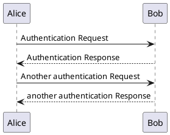

## **Objix**

A dangerously convienient, high performance, zero dependency, lightweight utility (2.7kb min) that injects usefull functions into the Object prototype to extend the standard library and sugar many common use cases when working with any Javascript objects.

The functions include copies of Object class methods and Array prototype methods that are applied to the values of the object as well others inspired by lodash and some extras to delete keys, stringify, promisify, compare, split and join objects, memoise functions, log messages, check types and trapping/observing property assignments.

These prototype methods are all non enumerable and are highly optimised with zero copy operations where possible. There is however very limited type checking to guard against unwanted side effects. Performance in most cases is signifantly faster than lodash equivalents especially when working with small objects. For example `ob.map(fn)` is typically over 65% faster than `_.mapValues(ob, fn)` according to simple [benchmarks](#benchmarks).

An online version of this readme with interactive examples is availble on https://objix.dev.

**NOTE:** With great power comes great responsibility and messing with Object prototypes may have unintended consequences in larger applications. However just think of all the time and key strokes you could save.

## Usage

### Node

- Install:

  ```bash
  > npm i -save objix
  ```

- Require:

  ```javascript
  require('objix')
  console.log({ a: 1 }.map(v => v + 1))
  ```

### Browser

```html
<script src="https://cdn.jsdelivr.net/gh/mattaylor/objix@main/objix.min.js"></script>

<script>
  o = { a: 1 }.map(v => v + 1)).log()
</script>
```

### Chaining

Most of these function return objects including those modifying `this` and so can be easily chained together.

<div data-runkit>

```javascript
var o = { a: 0, b: 1, c: 2 }.clean().map(v => v + 1) // { b: 2, c: 3 }
```

</div>

### Function Aliases

All functions documented below are also callable with a '\_\_' prefix to the function name.
This can help ensure that the function is availble and not overwritten by other object property assignments.

```javascript
var o = { a: 1 }.size() == { a: 1 }.__size() //true
var o = { a: 1 }.find(v => v) == { a: 1 }.__find(v => v) //true
```

### Exported Functions

All functions listed below are also available using traditional module exports, where the first argument of the function will be the object that the function is targeting as `this` if called via the object O.p.

```javascript
const _ = require('objix')

_.size({ a: 1 }) == { a: 1 }.size() // true
_.find({ a: 1 }, v => v) == { a: 1 }.find(v => v) //true
```

### Simple Classes

Any object can act as a class from which new objects can be derived. All properties of `this` are inherited - including traps!!

<div data-runkit>

```javascript
var Person = { firstName: 'john', lastName: 'doe' }
  .trap(v => new Date(v).getDate(), 'Invalid date', 'dob')
  .bind('age', t => Math.floor((Date.now() - new Date(t.dob)) / 31536000000))
  .bind('name', t => t.firstName + ' ' + t.lastName)

var p1 = Person.new({ firstName: 'jane' })
p1.name() // 'jane doe'
p1.dob = 'foobar' // Uncaught 'Invalid date [dob, foobar]'
p1.dob = '10/10/2000'
p1.age() // 22
```

</div>

## Object.prototype API

### Object..map(function, target={})

Returns `target` including all the keys of `this` with `function` applied to each value. Function takes value and key as arguments.

<div data-runkit>

```javascript
var o = { a: 1 }.map(v => v + 1) // { a: 2 }
var o = { a: 1, b: 2 }.map((v, k) => (k == 'b' ? v + 1 : v)) // { a: 1, b: 3 }
```

</div>

### Object..flatMap(function)

Returns a new object based on `this` but which may have a different set of properties. The `function` is applied to each entry of `this` and is expected to return an array of zero or more key,value entry pairs (eg `[[k1,v1],[k2,v2],..]`) which are then used to build the new object which is returned.

<div data-runkit>

```javascript
var o = { a: 1 }.flatMap((k, v) => [
  [k + 1, v + 1],
  [k + 2, v + 2]
]) // { a1: 2, a2: 3 }
var o = { a: 1, b: 0 }.flatMap((k, v) => (v ? [[k, v + 1]] : [])) // { a: 2 }
```

</div>

### Object..values()

Object.values(`this`)

<div data-runkit>

```javascript
var o = { a: 1 }.values() // [1]
```

</div>

### Object..create()

Object.create(`this`)

<div data-runkit>

```javascript
var o = { a: 1 }.create() // {}
o.a // 1
```

</div>

### Object..keys()

Object.keys(`this`)

<div data-runkit>

```javascript
var o = { a: 1 }.keys() // ['a']
```

</div>

### Object..entries()

Object.entries(`this`)

<div data-runkit>

```javascript
var o = { a: 1 }.entries() // [[a, 1]]
```

</div>

### Object..is(type)

True if `this` is an instance of `type`.

<div data-runkit>

```javascript
var a = []
var s = ''
var n = 1
var o = {}
var d = new Date()
var b = false
var f = () => 0
class Class1 {}
class Class2 extends Class1 {}
var c = new Class2()
s.is(String) // true
a.is(Array) // true
a.is(Object) // true
f.is(Function) // true
f.is(Object) // false
d.is(Date) // true
d.is(Object) // true
n.is(Number) // true
n.is(Object) // false
b.is(Boolean) // true
c.is(Class1) // true
c.is(Class2) // true
c.is(Object) // true
o.is(Object) // true
```

</div>

### Object..[@@iterator]

Iterate through the values of `this`

<div data-runkit>

```javascript
for (var v of { a: 1 }) console.log(v) // 1
```

</div>

### Object..clean()

Return a new object like `this` with falsy entry values removed

<div data-runkit>

```javascript
var o = { a: 1, b: null, c: false, d: 0, e: '' }.clean() // { a: 1 }
```

</div>

### Object..filter(function, target={})

Returns `target` including all entries of `this` for which the the supplied function returns truthy. Function takes value and key as arguments.

<div data-runkit>

```javascript
var o = { a: 1, b: 2 }.filter(v => v > 1) // { b: 2 }
var o = { a: 1, b: 2 }.filter((v, k) => k == 'b') // { b: 2 }
var o = { a: 1, b: 2 }.filter(v => v > 2) // {}
```

</div>

### Object..find(function)

Return first key of `this` where value passes function
Function takes value and key as arguments.

<div data-runkit>

```javascript
var o = { a: 1, b: 2 }.find(v => v > 1) // 'b'
var o = { a: 1, b: 2 }.find(v => v > 2) // null
```

</div>

### Object..assign(...objects)

Assign and overwrite entries of `this` from arguments in ascending priority and return `this`.

<div data-runkit>

```javascript
var o = { a: 1, b: 1 }.assign({ b: 2, c: 2 }, { c: 3 }) // { a: 1, b: 2, c: 3 }
```

</div>

### Object..extend(...objects)

Assigns properties into `this` from the arguments in ascending priority order. Properties of `this` are not overwritten and are assigned only if null or undefined in `this`.
Returns `this`

<div data-runkit>

```javascript
var o = { a: 1, b: 1 }.extend({ b: 2, c: 2 }, { c: 3 }) // { a: 1, b: 1, c: 3 }
```

</div>

### Object..same(object)

Return a new object with entries of `this` that are present in the supplied object with equal value

<div data-runkit>

```javascript
var o = { a: 1, b: 2 }.same({ a: 2, b: 2 }) // { b: 2 }
```

</div>

### Object..diff(object)

Return new object with entries of `this` that are not present in the supplied object with equal value

<div data-runkit>

```javascript
var o = { a: 1, b: 2 }.diff({ a: 2, b: 2 }) // { a: 1 }
```

</div>

### Object..delete(...keys)

Return `this` with entries deleted where the key is included in arguemnts.

<div data-runkit>

```javascript
var o = { a: 1, b: 2, c: 3 }.delete('a', 'b') // { c: 3 }
```

</div>

### Object..some(function)

True if any entry of `this` passes function.
Function takes value and key as arguments.

<div data-runkit>

```javascript
var o = { a: 1, b: 2 }.some(v => v > 1) // true
var o = { a: 1, b: 2 }.some(v => v > 2) // false
```

</div>

### Object..every(function)

True if all entries pass function.
Function takes value and key as arguments.

<div data-runkit>

```javascript
var o = { a: 1, b: 2 }.every(v => v > 0) // true
var o = { a: 1, b: 2 }.every(v => v > 1) // false
```

</div>

### Object..has(value)

Returns first key of `this` where the value equals the argument, otherwise undefined.

<div data-runkit>

```javascript
var o = { a: 1, b: 2 }.has(2) // b
var o = { a: 1, b: 2 }.has(0) // undefined
;[1].has(1) // 1
;[].has(1) // undefined
```

</div>

### Object..at(path)

Return the property of `this` at `path`. If `path` is string containing `.` delimited keys then the `this` will be traversed accordingly. E.G `o.at('k1.k2')` will return `o.k1.k2`

<div data-runkit>

```javascript
var o = { a: 1 }.at('a') // 1
var o = { a: 1, b: [1, 2] }.at('b.1') // 2
var o = { a: 1, b: { c: 3 } }.at('b.c') // 3
```

</div>

### Object..\$(formatter)

Returns a string representation of `this`. If `formatter` is not specified it will return a a string based on `JSON.stringify` with all double quote and escape characters removed.

If `formatter` is a string, then that string will be returned with all occurances of `${key}` or `$key` substituted with `this.at(key).$()`

If `formatter` is not a string then the `stringify` method of the `Formatter` will be called with `this` as an argument, allowing alternative standard formatters such as `JSON` to be used. If there the formatter does not have a stringify method then `formatter` will be called as a function with `this` as its argument.

<div data-runkit>

```javascript
var o = { a: 1 }.$() // '{a:1}'
var o = { a: 1, b: [2, 3], c: { d: 'four,five' } }.$() // '{a:1,b:[2,3],c:{d:four,five}}'
var o = { a: 1 }.$(JSON) // '{"a":1}'
var o = { a: 1 }.$(JSON.stringify) // '{"a":1}'
var o = { a: 1, b: { c: 2 } }.$('b is $b and b.c is ${b.c}') // 'b is {c:2} and b.c is 2'
```

</div>

### Object..clone(depth)

Return new object with entries cloned from `this`.
Nested objects are also cloned to specified depth (-1 = any depth)

<div data-runkit>

```javascript
var o1 = { a: 1, b: { c: 1 } }
var o2 = o1.clone()
var o3 = o1.clone(1)
o1.b.c = 2
o1.a = 2
o1 // { a: 2, b: { c: 2 }}
o2 // { a: 1, b: { c: 2 }}
o3 // { a: 1, b: { c: 1 }}
```

</div>

### Object..join(...objects)

Return a new Object with the same keys as `this` and some values as arrays which concatenate the original value of `this` with values from all of the arguments having the same key.

<div data-runkit>

```javascript
var o = { a: 1 }.join({ a: 2 }, { a: 3 }) // { a: [ 1, 2, 3 ]}
```

</div>

### Object..split()

Return Array of new objects for each value in each entry of `this` with a value array

<div data-runkit>

```javascript
var o = { a: [1, 2] }.split() // [{ a: 1 }, { a: 2 }]
```

</div>

### Object..contains(object, depth)

True if all entries of argument are also in `this`. May recurse to a given depth (-1 = any depth)

<div data-runkit>

```javascript
var o = { a: 1 }.contains({ a: 1, b: 2 }) // false
var o = { a: 1, b: 2 }.contains({ a: 1 }) // true
var o = { a: 1, b: [{ c: 1 }] }.contains({ c: 1 }, 1) // false
var o = { a: 1, b: [{ c: 1 }] }.contains({ c: 1 }, 2) // true
```

</div>

### Object..eq(object, depth)

True if all entries of `this` equal the argument and argument has no other entries
May recurse to a given depth (-1 for any depth)

<div data-runkit>

```javascript
var o = { a: 1 }.eq({ a: 1 }) // true
var o = { a: 1 }.eq({ a: 2 }) // false
var o = { a: 1, b: { c: 1 } }.eq({ a: 1, b: { c: 1 } }) // false
var o = { a: 1, b: { c: 1 } }.eq({ a: 1, b: { c: 1 } }, 1) // true
```

</div>

### Object..size()

Return number of entries of `this`.

<div data-runkit>

```javascript
;[1, 2, 3].size() // 3
var o = { a: 1, b: 2 }.size() // 2
'one'.size() // 3
```

</div>

### Object..keyBy(array, key)

Index an array of objects into `this` using the given key, and return `this`.

<div data-runkit>

```javascript
o = {}
o.keyBy([{ a: 'o1' }, { a: 'o2' }, { a: 'o2', b: 1 }], 'a')
o // { o1: { a: 'o1' }, o2: [{ a: 'o2', b: 1 }, { a: 'o2' }]
```

</div>

### Object..memo(expires)

Returns a memoized wrapper around `this` as a function such that any calls to `this` with the same set of arguments within `expires` seconds will return the first cached result, without re-executing the function. Cached results are indexed by the `$()` representation of the arguments the function was orignally called with and are automatically removed after `expires` seconds have elapsed.

<div data-runkit>

```javascript
var nowish = (() => new Date()).memo(1)
nowish() // 2022-10-17T00:01:00.364Z
nowish() // 2022-10-17T00:01:00.364Z
setTimeout(() => nowish(), 1000) // 2022-10-17T00:01:01.565Z
```

</div>

### Object..bind(key, function, expires)

Binds a function to `this` as a non enumerable property using the given key. When called `this` will be applied as the **last** argument.

If `expires` is defined then the function will be memoized with the given expiration time in seconds.
Always returns `this`

<div data-runkit>

```javascript
var o = { a: 1, b: 2, c: 3 }
o.bind('max', m => m.values().sort((a, b) => b - a)[0])
o.max() // 3

o.bind('nowish', () => new Date(), 1)
o.nowish() // 2022-10-17T00:01:00.364Z
o.nowish() // 2022-10-17T00:01:00.364Z
setTimeout(() => o.nowish(), 1000) // 2022-10-17T00:01:01.565Z
```

</div>

### Object..log(msg, test, type='log')

Prints a shallow clone of `this` to the console together with a minute timestamp and an optional msg.
If a `test` function is provided then logging will only be triggered if the test function returns truthy when called with with `this` as its first argument.
Alternative console methods such as 'trace', 'info', 'error' and 'debug' may also be specified. Returns `this`.

<div data-runkit>

```javascript
var WARN = () => false
var INFO = () => true

var o = { a: 0, b: 1 }
  .clean()
  .log('CLEANING') // 2022-10-07T00:00 CLEANNING { b: 1 }
  .map(v => v + 1)
  .log('MAPPING', WARN) // ..
  .log('TRACING', INFO, 'trace') // Trace: 2022-10-06T21:21 TRACING { b: 2 } at  log ..
```

</div>

### Object..try(function, catch)

Calls function with `this` as its argument and return the result.
If an exception is thrown or the function returns null or undefined then `this` is returned instead.

If `catch` is defined and an exception is thrown then the catch function will be called with the error and `this` as arguments. If the result of the `catch` function is not null or undefined then this value will be returned instead of `this`.

If no `catch` function is defined then all exceptions will be ignored, and `this` will be returned.

<div data-runkit>

```javascript
var o = { a: 1 }.try(o => o.a++) // 2
var o = { a: 1 }.try(o => (o.a++, o)) // { a: 2 }
var o = { a: 1 }.try(o => (o.a.b++, o)) // { a: 1 }
var o = { a: 1 }.try(
  o => o.a.b.c++,
  e => e.log()
) // 2022-10-07T00:00 TypeError: Cannot read properties of undefined (reading 'b')
```

</div>

### Object..trap(function, error, ...keys)

Returns a proxy of `this` which traps property assignments using the supplied function. The function takes `val`, `key` and `this` as arguments.
If the function returns falsey and an error message is supplied then an exception will be thrown.
If no error message is provided the function just acts as an observer, although the trap may also update `this` if needed.
When `keys` are defined then the trap function will only be called for assignments to properties where the key is included in `keys`

<div data-runkit>

```javascript
var o = { a: 1, sum: 1 }
  .trap((v, k, t) => v != t[k] && console.log(k + ' has changed'))
  .trap(v => v > 0, 'Values must be positive', 'a', 'b', 'c')
  .trap((v, k, t) => k != 'sum' && (t.sum += t[k] ? v - t[k] : v))
  .trap(v => false, 'Read only', 'sum')

o.b = 2 //  b has changed
o.c = 0 //  Uncaught 'Values must be positive, c, 0'
o.sum = 1 // Uncaught 'Read only, sum, 1'
o // { a: 1, b: 2, sum: 3 }
```

</div>

### Object..new(object)

Create a new object using `this` as its protoype with additonal properties assigned from the argument. If traps have been defined for `this`, then the new object will also be a Proxy with the same trap handlers but will target a new object which uses `this` as its Object..

<div data-runkit>

```javascript
var P = { a: 1 }.trap(v => v > 0, 'Not Positive')
var o1 = P.new({ b: 1 }) // { a: 1, b: 1 }
var o2 = P.new({ a: 2 }) // { a: 2 }
o1.c = 0 // // Uncaught 'Not Positive, c, 0'
```

</div>

### Object..wait(defer)

Returns a new promise wrapped around `this`.
If `defer` is a number then the promise will resolve with `this` when `defer` seconds have elapsed.
Otherwise `defer` will be treated as a function that takes `this`, `resolve` and optionally `reject` as arguments, and the promise will resolve when `resolve` is called with the result. Any uncaught exceptions will reject the promise.
If `defer` is async or otherwsie returns a truthy value then the promise will be resolved with that result.

<div data-runkit>

```javascript
var o = { a: 1 }.wait(1).then(t => t.log('PROMISED')) // ...(1 second later)... 2022-10-19T21:55 PROMISED {a:1}
var o = (await { a: 1 }.wait(1)).log('AWAITED') // ...(1 second later)... 2022-10-19T21:55 AWAITED {a:1}

var f = o =>
  o
    .wait((t, r) => r(t.b.$()))
    .then(o => o.log('SUCCESS'))
    .catch(e => e.log('ERROR'))

f({ a: 1, b: 2 }) // 2022-10-19T21:55 SUCCESS 2
f({ a: 1 }) // 2022-10-19T21:55 ERROR TypeError: Cannot read properties of undefined

var s = (await 'https://objix.dev'.wait(fetch)).status // 200
```

</div>

## Benchmarks

Performance of some common operations can be compared to lodash using the [benchmarks](bench.js) script.

```bash
> node bench <iterations=1000> <heats=100> <simple=10> <complex=1>
```

|              |                                              |
| ------------ | -------------------------------------------- |
| `iterations` | Number of iterations per heat                |
| `heats`      | Number of randomised heats                   |
| `simple`     | Number of simpled properties per test object |
| `complex`    | Number of complex properties per test object |

This script prints out a table of average operations per secs for each test function
for lodash, objix and a basic vanilla alternative together with the mean error coefficient accross the heats and the % performance improvments of objix against lodash.

For simple object objix performs insanely well, but this drops off quickly when more complex objects are tested.

### Ops/sec (iters: 1000, heats: 100, simple: 10, complex: 0)

| (index) | objix    | lodash   | vanilla  | % Inc   | % Err |
| ------- | -------- | -------- | -------- | ------- | ----- |
| Map     | 7012.38  | 4195.86  | 1050.79  | 67.13   | 14.8  |
| Filter  | 38468.78 | 1126.07  | 1529.99  | 3316.2  | 18.86 |
| Find    | 74188.6  | 20799.43 | 15938.13 | 256.69  | 22.95 |
| KeyBy   | 9383.75  | 6485.31  |          | 44.69   | 19.94 |
| Equals  | 2297.18  | 1340.82  | 1240.04  | 71.33   | 11.84 |
| Clone   | 6170.77  | 2091.45  | 8157.8   | 195.05  | 10.62 |
| Deep    | 2594.48  | 1381.53  |          | 87.8    | 10.77 |
| Extend  | 11217.6  | 8173.79  | 4990.64  | 37.24   | 16.67 |
| Some    | 5362.03  | 3119.58  | 4735.68  | 71.88   | 9.95  |
| Every   | 91059.92 | 6736.96  | 25402.9  | 1251.65 | 20.86 |

### Ops/sec (iters: 1000, heats: 100, simple: 10, complex: 1)

| (index) | objix    | lodash   | vanilla  | % Inc   | % Err |
| ------- | -------- | -------- | -------- | ------- | ----- |
| Map     | 4259.97  | 2944.87  | 866.31   | 44.66   | 12.15 |
| Filter  | 7833.53  | 1042.81  | 1282.9   | 651.19  | 10.03 |
| Find    | 76332.7  | 20380.14 | 15779.81 | 274.54  | 23.19 |
| KeyBy   | 9069.12  | 6443.92  |          | 40.74   | 21.64 |
| Equals  | 2071.18  | 1223.36  | 1161.06  | 69.3    | 10.07 |
| Clone   | 5441.61  | 1849.79  | 7005.51  | 194.17  | 9.63  |
| Deep    | 399.3    | 318.94   |          | 25.2    | 7.25  |
| Extend  | 11065.27 | 7604.92  | 4522.67  | 45.5    | 17.6  |
| Some    | 3835.54  | 2530.53  | 3581.07  | 51.57   | 9.2   |
| Every   | 88203.64 | 6055.98  | 23058.4  | 1356.47 | 21.38 |

### Ops/sec (iters: 1000, heats: 100, simple: 10, complex: 10)

| (index) | objix   | lodash  | vanilla | % Inc  | % Err |
| ------- | ------- | ------- | ------- | ------ | ----- |
| Map     | 656.5   | 680.92  | 216.47  | -3.59  | 6.55  |
| Filter  | 795.29  | 433.24  | 275.08  | 83.57  | 4.57  |
| Find    | 3741.3  | 3714.32 | 530.39  | 0.73   | 7.26  |
| KeyBy   | 9374.13 | 6412.73 |         | 46.18  | 20.06 |
| Equals  | 471.47  | 432.91  | 439.48  | 8.91   | 4.88  |
| Clone   | 984.67  | 801.21  | 294.05  | 22.9   | 4.54  |
| Deep    | 68.29   | 206.85  |         | -66.99 | 5.93  |
| Extend  | 9473.53 | 7550.47 | 230.18  | 25.47  | 12.98 |
| Some    | 725.86  | 758.97  | 408.42  | -4.36  | 4.42  |
| Every   | 3085.48 | 2110.81 | 621.44  | 46.18  | 5.98  |

### Scratch

<!-- tabs:start -->

#### **PlantUML**



#### **VegaLite**

```vegalite
{
  "$schema": "https://vega.github.io/schema/vega-lite/v4.json",
  "description": "Horizontally concatenated charts that show different types of discretizing scales.",
  "data": {
    "values": [
      {"a": "A", "b": 28},
      {"a": "B", "b": 55},
      {"a": "C", "b": 43},
      {"a": "D", "b": 91},
      {"a": "E", "b": 81},
      {"a": "F", "b": 53},
      {"a": "G", "b": 19},
      {"a": "H", "b": 87},
      {"a": "I", "b": 52}
    ]
  },
  "hconcat": [
    {
      "mark": "circle",
      "encoding": {
        "y": {
          "field": "b",
          "type": "nominal",
          "sort": null,
          "axis": {
            "ticks": false,
            "domain": false,
            "title": null
          }
        },
        "size": {
          "field": "b",
          "type": "quantitative",
          "scale": {
            "type": "quantize"
          }
        },
        "color": {
          "field": "b",
          "type": "quantitative",
          "scale": {
            "type": "quantize",
            "zero": true
          },
          "legend": {
            "title": "Quantize"
          }
        }
      }
    },
    {
      "mark": "circle",
      "encoding": {
        "y": {
          "field": "b",
          "type": "nominal",
          "sort": null,
          "axis": {
            "ticks": false,
            "domain": false,
            "title": null
          }
        },
        "size": {
          "field": "b",
          "type": "quantitative",
          "scale": {
            "type": "quantile",
            "range": [80, 160, 240, 320, 400]
          }
        },
        "color": {
          "field": "b",
          "type": "quantitative",
          "scale": {
            "type": "quantile",
            "scheme": "magma"
          },
          "legend": {
            "format": "d",
            "title": "Quantile"
          }
        }
      }
    },
    {
      "mark": "circle",
      "encoding": {
        "y": {
          "field": "b",
          "type": "nominal",
          "sort": null,
          "axis": {
            "ticks": false,
            "domain": false,
            "title": null
          }
        },
        "size": {
          "field": "b",
          "type": "quantitative",
          "scale": {
            "type": "threshold",
            "domain": [30, 70],
            "range": [80, 200, 320]
          }
        },
        "color": {
          "field": "b",
          "type": "quantitative",
          "scale": {
            "type": "threshold",
            "domain": [30, 70],
            "scheme": "viridis"
          },
          "legend": {
            "title": "Threshold"
          }
        }
      }
    }
  ],
  "resolve": {
    "scale": {
      "color": "independent",
      "size": "independent"
    }
  }
}
```

<!-- tabs:end -->
